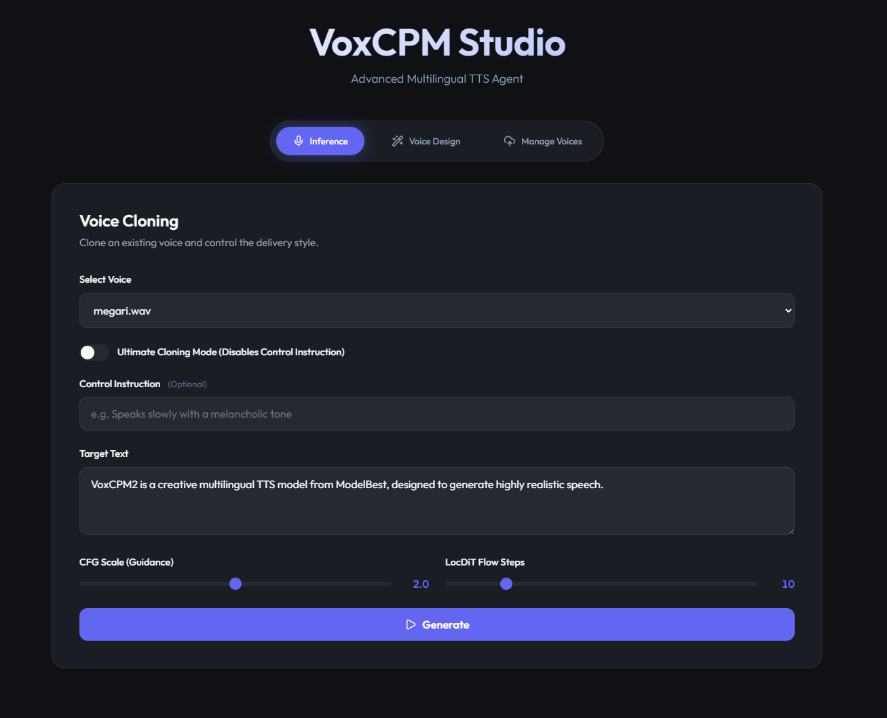

<div align="center">

# 🎙️ VoxCPM2 TTS API



**A standalone, tokenizer-free text-to-speech API powered by VoxCPM.**

[](LICENSE)
[](https://fastapi.tiangolo.com)
[](https://reactjs.org/)

</div>

---

**VoxCPM2 TTS API** provides a high-performance FastAPI backend, zero-shot voice cloning without transcription, and a sleek, modern React frontend for seamless voice library management and inference.

## ✨ Features

- ⚡ **FastAPI Backend:** Fast, asynchronous, and highly reliable TTS generation API.
- 🎯 **Zero-Shot Voice Cloning:** Clone any voice using just a short reference audio clip—**no ASR transcription required!**
- 🎨 **Voice Design:** Create unique voices from scratch simply by describing them in text (e.g., *"Speaks slowly with a melancholic tone"*).
- ⚛️ **Modern React Frontend:** A beautiful web interface to manage your voice library and generate speech with real-time audio playback.
- 🗂️ **Voice Library Management:** Easily upload, list, and delete voice references directly from your browser. 

## 📦 Requirements

- **Python 3.10+** *(Recommended: use [uv](https://github.com/astral-sh/uv) for lightning-fast dependency management)*
- **Node.js 18+** *(For running the frontend interface)*

## 🚀 Installation & Setup

### 1️⃣ API Setup (using `uv`)

First, navigate to the root directory and install the Python dependencies:

```bash
# Install dependencies and generate uv.lock
uv lock
uv sync

# Alternatively, run the provided script
run_api.bat
```

> **Note:** The API server will start on `http://0.0.0.0:8000`.

### 2️⃣ Frontend Setup (using `npm`)

Open a new terminal, navigate to the `frontend` folder, and install the required dependencies:

```bash
cd frontend
npm install

# Start the frontend development server
npm run dev
```

> **Note:** The frontend will typically start on `http://localhost:5173`.

## 🎙️ Voice Library Management

Manage your custom voices directly through the frontend's **"Manage Voices"** tab:

- **➕ Add a Voice:** Upload a `.wav` or `.mp3` file and assign it a name. The API securely saves the audio file inside an isolated ID folder along with its configuration. No transcription is run, saving your VRAM and processing time!
- **🗑️ Delete a Voice:** Easily remove any voice you no longer need. This cleanly removes the folder and files.
- **🎤 Use a Voice:** Select your saved voice in the Inference tab to clone it instantly.

## 📖 API Documentation

For detailed information on the available REST endpoints and how to integrate them, see the [API Documentation](api_docs.md).

## 🤝 Credits

This API is proudly powered by the [VoxCPM](https://github.com/OpenBMB/VoxCPM) project by **OpenBMB**.

## 📄 License

This project is licensed under the **Apache License 2.0**. See the [LICENSE](LICENSE) file for full details.

---

<div align="center">

## 💖 Support Me

If you find this project useful, consider supporting my work!

<a href="https://ko-fi.com/megaaziib" target="_blank"></a>

🪙 **Solana / USDC / USDT (Solana Network):**  
`9rupbyrM19RaVbHmJ4fusozux6P9t72GoYB7Sdy4Nmks`

<br>
<i>Built with ❤️ for the AI Voice Community</i>

</div>
